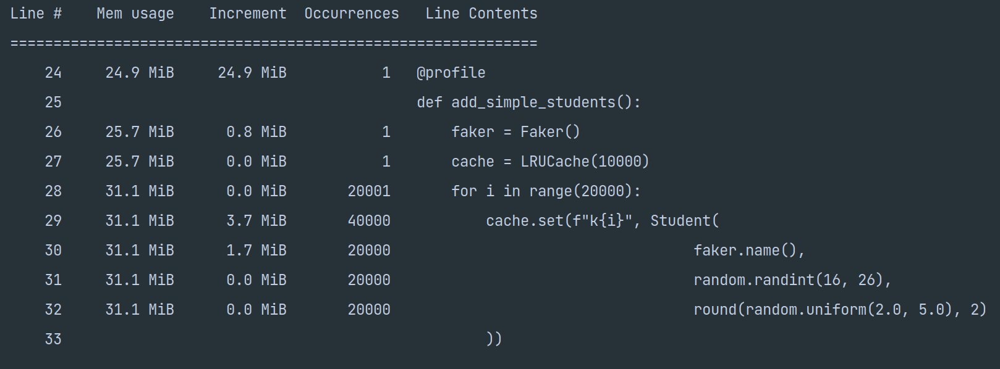
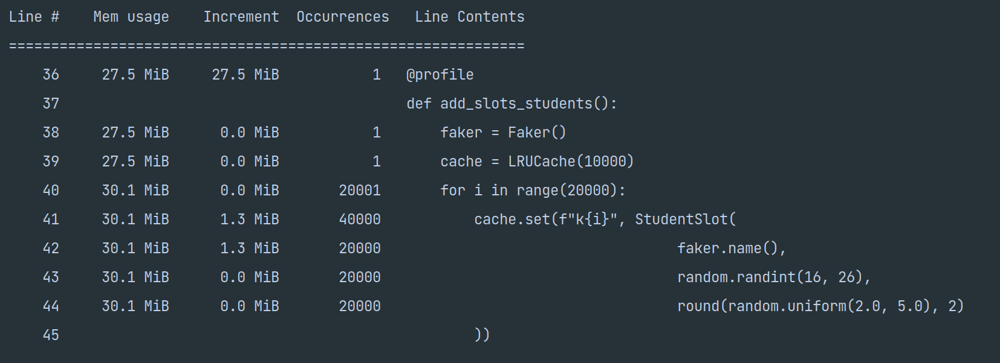
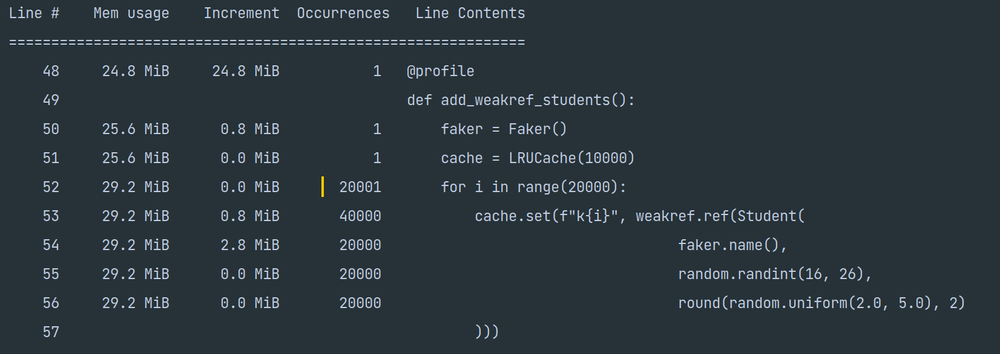

## Profiling results

### Conclusions
1) Slots save memory compared to simple classes (only if amount of objects is high enough)
2) Usage of weakrefs can save memory, because we store only refs in cache, but in reality consumption of memory is higher