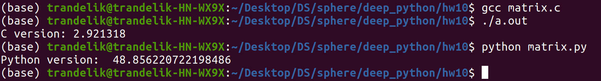

## Matrix multiplication on C and Python
### Testing conditions
1) Sequence of 100 matrices of size 100 * 100
2) Matrices are filled with random numbers
3) Multiplication modulo 100000000
4) Python code and C code are equivalent
### Results
C version: 2.921318s
Python version: 48.856221s

It means that C version is more than 16 times faster

